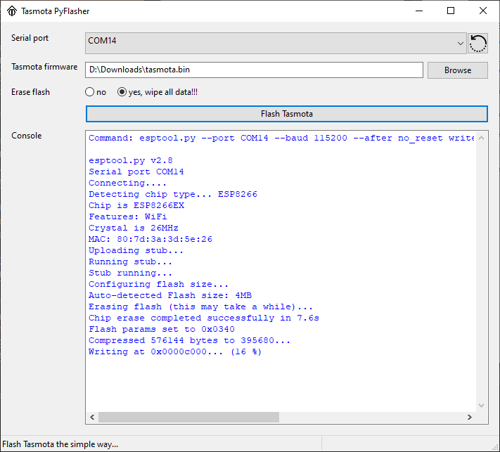

# Tasmota PyFlasher
[](https://github.com/marcelstoer/nodemcu-pyflasher/blob/master/LICENSE)
[](https://github.com/Jason2866/tasmota-pyflasher/releases)


Self-contained [Tasmota](https://https://github.com/arendst/Tasmota) flasher with GUI based on [esptool.py](https://github.com/espressif/esptool) and [wxPython](https://www.wxpython.org/).



## Installation
Tasmota PyFlasher doesn't have to be installed, just double-click it and it'll start. Check the [releases section](https://github.com/Jason2866/tasmota-pyflasher/releases) for download.

## Getting help
In the unlikely event that you're stuck with this simple tool the best way to get help is to turn to the ["Tools and IDE" subforum on esp8266.com](http://www.esp8266.com/viewforum.php?f=22).

## Donationware
Show your love and support for open-source development by donating to the Author of the original tool (NodeMCU PyFlasher).

## Build it yourself
If you want to build this application yourself you need to:

- Install [Python 3.x](https://www.python.org/downloads/) and [Pip](https://pip.pypa.io/en/stable/installing/) (it comes with Python if installed from `python.org`).
- Create a virtual environment with `python -m venv venv`
- Activate the virtual environment with `. venv/bin/activate` (`. venv/Scripts/activate` if you are on Windows with [Cygwin](https://www.cygwin.com/) or [Mingw](http://mingw.org/))
- Run `pip install -r requirements.txt`

**A note on Linux:** As described on the [downloads section of `wxPython`](https://www.wxpython.org/pages/downloads/), wheels for Linux are complicated and may require you to run something like this to install `wxPython` correctly:

```bash
# Assuming you are running it on Ubuntu 18.04 LTS with GTK3
pip install -U \
    -f https://extras.wxpython.org/wxPython4/extras/linux/gtk3/ubuntu-18.04 \
    wxPython
```

## Why?

There is no easy tool for flashing Tasmota 

## License
[MIT](http://opensource.org/licenses/MIT) © Marcel Stör
